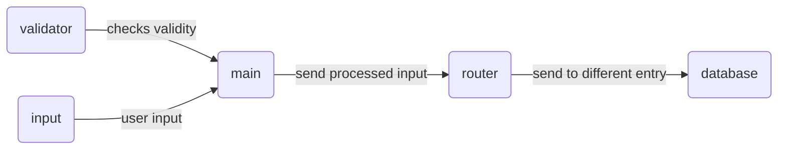

Commands
---
### Create
#### `add <flag1> <value1> <flag2> <value2>...`
|🚩**Flags**|↪️**Description**|⚠️**Input Constraints**|
|:----------|:---------------|:---------------------|
|`-n, --name`|set the task name|*Length: 1-15*|
|`-c, --category`|set the task category|*Length: 1-15*|
|`-C, --completed`|set task as completed status **(optional)**|*Options:* `true / false` (default=`false`)|
|`-d, --due`|set a due for the task **(optional)**|*Format:* `YYYY-MM-DD@hr:min:sec`|
     
### Read
#### `ls <flag> <value>`
|🚩**Flags**|↪️**Description**|⚠️**Input Constraints**|
|:----------|:---------------|:---------------------|
|`-a, --all`|show tasks by selected criteria|*Options:* `name / category / completed / expire`|
|`-i, --id`|show task by id|*Type: Integer*|
|`-n, --name`|show task by name|*Length: 1-15*|
|`-c, --category`|show tasks by category|*Length: 1-15*|
|`-C, --completed`|filter by completed status|*Options:* `true / fasle`|
|`-e, --expire`|filter by expire status|*Options:* `true / false`|

### Update
#### `upt <search-flag> <search-value> <update-flag> <new-value>`
|🚩**Flags**|↪️**Description**|⚠️**Input Constraints**|
|:----------|:---------------|:---------------------|
|`-i, --id`|**search** by id|*Type: Integer*|
|`-n, --name`|**search/update** the task name|*Length: 1-15*|
|`-c, --category`|**update** the task category|*Length: 1-15*|
|`-C, --completed`|**update** the task completed status|*Options:* `true / false`|
|`-d, --due`|**update** the due of the task|*Format:* `YYYY-MM-DD@hr:min:sec`|

### Delete
#### `rm <flag> <value>`
|🚩**Flags**|↪️**Description**|⚠️**Input Constraints**|
|:----------|:---------------|:---------------------|
|`-i, --id`|delete the task by selected id|*Type: Integer*|
|`-n, --name`|delete the task matching the given name|*Length: 1-15*|
|`-c, --category`|delete all the tasks matching the given category|*Length: 1-15*|
|`-C, --completed`|delete all the tasks matching the given completed status|*Options:* `true / false`|
|`-e, --expire`|delete all the tasks matching the given expire status|*Options:* `true / false`|

Logic
---

Command Line Features 
---
*Note: Both features are available on UNIX and windows system*
- Navigate command history using the `Up` and `Down` arrow keys  
- Move the cursor using the `Left` and `Right` arrow keys

